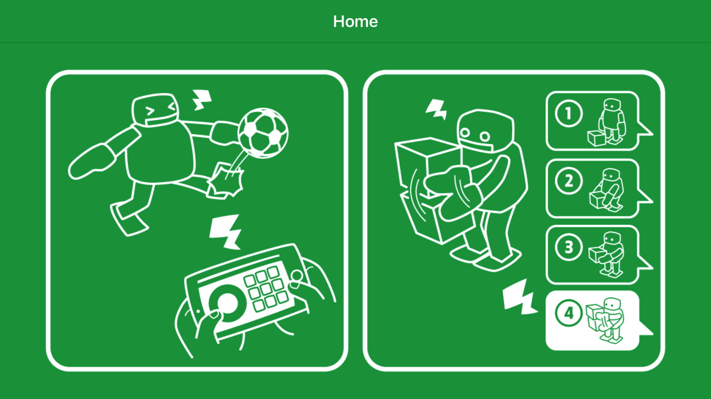
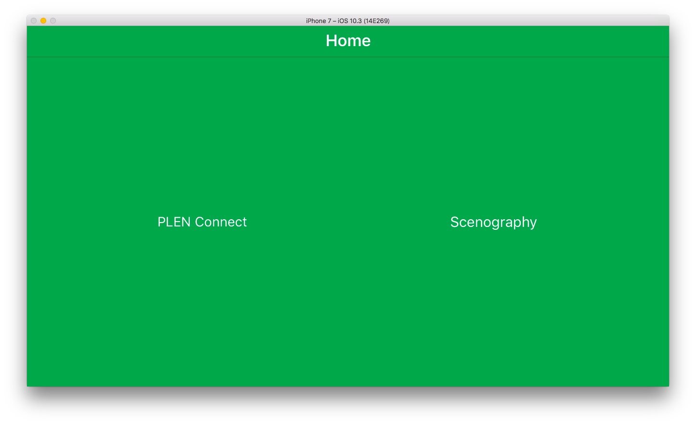

PLEN Connect for iOS | PLEN Project Company
===============================================================================

## Control and Program

Each buttons and joystick can send a motion to PLEN.

Visual programming language for iOS.

## Copyright (c) 2016,
- [Tatsuroh Sakaguchi](https://github.com/Tacha-S)
- [Kazuma TAKAHARA](https://github.com/kzm4269)
- [Mayuko SUGII](https://www.facebook.com/%E3%83%99%E3%83%AA%E3%83%BC%E3%83%9A%E3%82%A4%E3%83%B3%E3%83%88-MAYU-238870666291955/)
- [PLEN Project Company](https://plen.jp/)

## Build Environment
- OSX Sierra 10.12.4
- Xcode 8.3

## License
This software is released under the MIT License.
